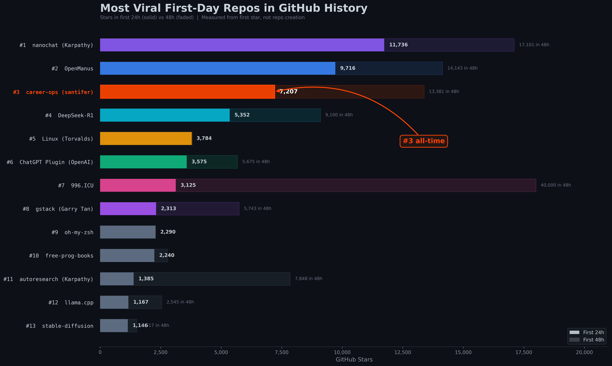
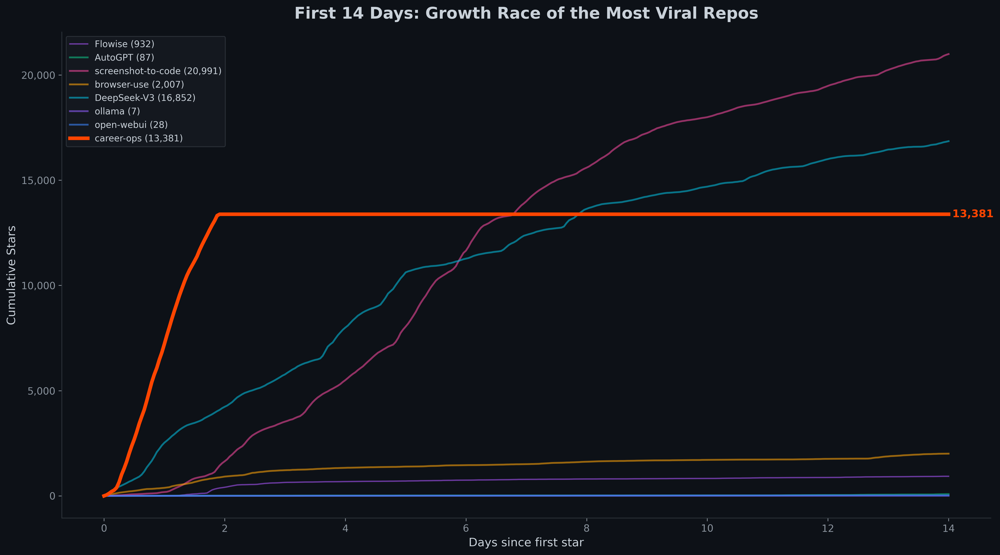

# GitHub Star Tracker

**[:gb: English](#the-problem)** | **[:es: Español](#es-versión-en-español)**

> Analyze, compare, and predict GitHub repo growth. Find out where your repo ranks among the most viral in GitHub history.

<div align="center">
    
</div>

## The Problem

You just got a spike of GitHub stars. But **how does your growth compare to the biggest repos in history?** GitHub doesn't show you growth velocity, historical ranking, or projections. You're flying blind.

## The Solution

A toolkit that goes beyond simple star counts:

- **Percentile ranking** — Instantly know where your repo stands among 1M+ public repos
- **Star history comparison** — Normalized growth curves against any repo (React, DeepSeek, AutoGPT...)
- **Viral ranking** — First-day star count compared to the most viral repos ever
- **Growth projections** — Peer-analogy predictions: "If you follow ollama's trajectory, you'll hit 50K in X months"

<div align="center">
    
</div>

## Tech Stack


## Installation

```bash
# Clone the repo
git clone https://github.com/santifer/GitStarPercentile.git
cd GitStarPercentile

# Set up virtual environment
python3 -m venv .venv
source .venv/bin/activate
pip install pandas matplotlib numpy requests
```

You also need the GitHub CLI authenticated:

```bash
gh auth login
```

## Usage

### 1. Quick Percentile Check

```bash
pip install git-star-percentile --upgrade
git-star-percentile
```

```
Enter your GitHub repo star count: 200
Your repo is approximately among the top 0.0743%.
```

### 2. Star History & Growth Projections

Compare your repo against top repos with normalized growth curves and peer-analogy projections:

```bash
# Compare against default viral repos (AutoGPT, ollama, DeepSeek, etc.)
python star_history.py owner/your-repo

# Or pick your own comparisons
python star_history.py owner/your-repo --compare facebook/react ollama/ollama n8n-io/n8n
```

**Output:**
- `assets/star_growth_analysis.png` — 3 charts: growth race, velocity, projections
- Console report with growth rates and milestone predictions

<details>
<summary>Example console output</summary>

```
=======================================================
  your-repo Growth Analysis
=======================================================
  Current: 13,381 stars

  Growth comparison at ~13K stars:
    ollama              :  1,092 stars/week (when at ~13K, Nov 2023)
    DeepSeek-V3         :  2,526 stars/week (when at ~13K, Dec 2024)

  Peer analogy: time from 13K to milestones:
    AutoGPT             : 13K -> 20K in 3 days
    ollama              : 13K -> 20K in 34 days
    DeepSeek-V3         : 13K -> 20K in 19 days
=======================================================
```
</details>

### 3. Viral Ranking

Find where your repo ranks among the most viral first-day repos in GitHub history:

```bash
# Rank your repo against ~100+ known viral repos
python viral_ranking.py owner/your-repo

# Or just see the ranking without highlighting
python viral_ranking.py
```

Analyzes ~100+ top repos and known viral repos. Ranks by stars received in the first 24 hours.

### 4. Viral Charts

Generate publication-ready charts for the viral ranking and growth race:

```bash
python viral_chart.py
```

**Output:**
- `assets/viral_ranking.png` — Horizontal bar chart ranking repos by first-24h stars
- `assets/viral_first_week_race.png` — First 14 days cumulative growth race

### Caching

All stargazer data is cached in `cache/`. Subsequent runs are instant. To refresh a specific repo:

```bash
rm cache/owner_repo.json
python star_history.py owner/your-repo
```

## Data Source & Methodology

- Star timestamps come from the **GitHub Stargazers API** (`Accept: application/vnd.github.star+json`)
- Each star's exact timestamp is recorded — no estimates or sampling
- "First 24h" is measured from the **first star**, not repo creation date
- GitHub API limits stargazer pagination to 40,000 entries (pages 1-400)
- The viral ranking sample includes ~113 repos (top by total stars + known viral repos) — not exhaustive
- Results are fully reproducible by anyone with a GitHub token

## Scripts

| Script | Purpose |
|--------|---------|
| `star_history.py` | Fetch star history, compare growth, project milestones |
| `viral_ranking.py` | Rank repos by first-day virality across GitHub |
| `viral_chart.py` | Generate publication-ready viral ranking charts |
| `count_all_repo_stars.py` | Crawl all public repos for star distribution (from upstream) |
| `plot_histogram.py` | Plot star distribution histogram (from upstream) |

## License

MIT — see [LICENSE](LICENSE)

## Credits

Built on top of [ChenLiu-1996/GitStarPercentile](https://github.com/ChenLiu-1996/GitStarPercentile) which provides the base percentile calculation and star distribution data.

---

# :es: Versión en Español

> Analiza, compara y predice el crecimiento de repos en GitHub. Descubre dónde se posiciona tu repo entre los más virales de la historia.

## El Problema

Tu repo acaba de tener un spike de estrellas. Pero **¿cómo se compara tu crecimiento con los repos más grandes de la historia?** GitHub no te muestra velocidad de crecimiento, ranking histórico, ni proyecciones.

## La Solución

Un toolkit que va más allá del conteo simple de estrellas:

- **Ranking por percentil** — Sabe al instante dónde está tu repo entre 1M+ de repos públicos
- **Historial de estrellas comparativo** — Curvas de crecimiento normalizadas contra cualquier repo
- **Ranking viral** — Estrellas en el primer día comparadas con los repos más virales de la historia
- **Proyecciones de crecimiento** — Predicciones por analogía: "Si sigues la trayectoria de ollama, llegarás a 50K en X meses"

## Instalación

```bash
git clone https://github.com/santifer/GitStarPercentile.git
cd GitStarPercentile
python3 -m venv .venv
source .venv/bin/activate
pip install pandas matplotlib numpy requests
gh auth login
```

## Uso

```bash
# Percentil rápido
pip install git-star-percentile --upgrade
git-star-percentile

# Historial y proyecciones (tu repo vs top virales)
python star_history.py owner/tu-repo

# Historial con repos a medida
python star_history.py owner/tu-repo --compare facebook/react ollama/ollama

# Ranking viral (tu posición entre los más virales de GitHub)
python viral_ranking.py owner/tu-repo

# Gráficas publicables
python viral_chart.py
```

## Fuente de Datos y Metodología

- Los timestamps provienen de la **API de Stargazers de GitHub** (`Accept: application/vnd.github.star+json`)
- Cada timestamp es un dato real de GitHub — sin estimaciones
- "Primeras 24h" se mide desde la **primera estrella**, no desde la creación del repo
- La muestra del ranking viral incluye ~113 repos — no es exhaustiva
- Los resultados son **100% reproducibles** por cualquiera con un token de GitHub

## Créditos

Construido sobre [ChenLiu-1996/GitStarPercentile](https://github.com/ChenLiu-1996/GitStarPercentile) que proporciona el cálculo base de percentiles y los datos de distribución de estrellas.

## Let's Connect

[](https://santifer.io)
[](https://linkedin.com/in/santifer)
[](mailto:hola@santifer.io)
